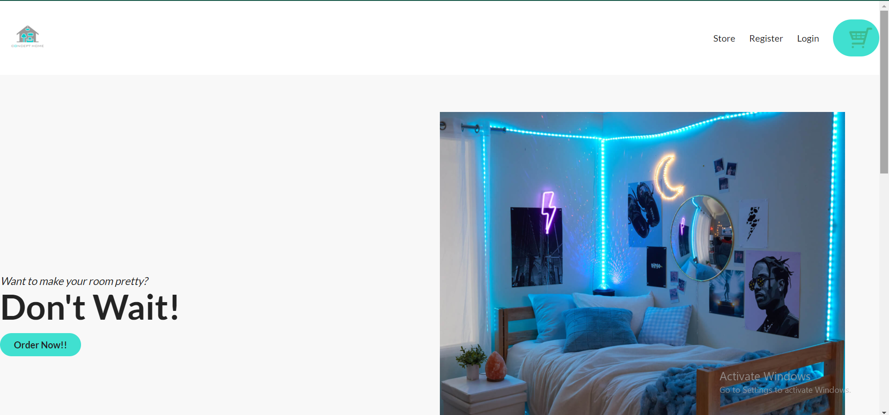
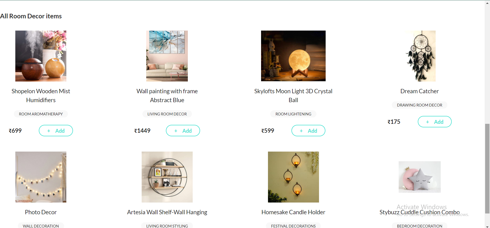
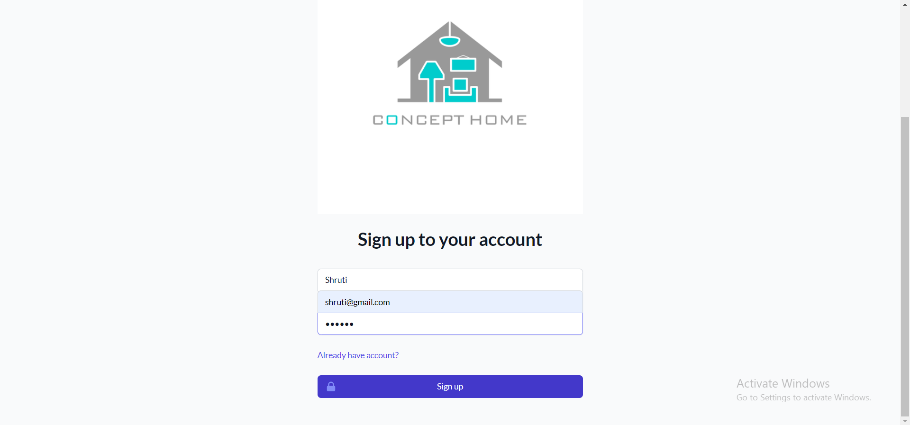
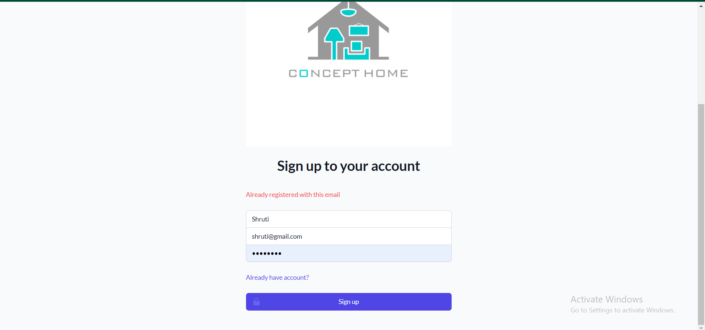
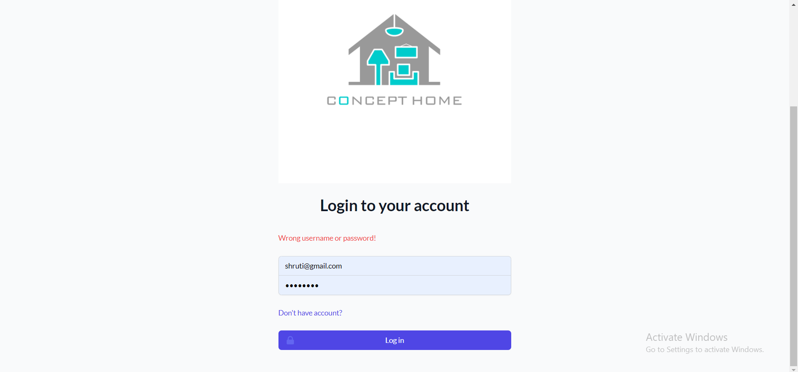
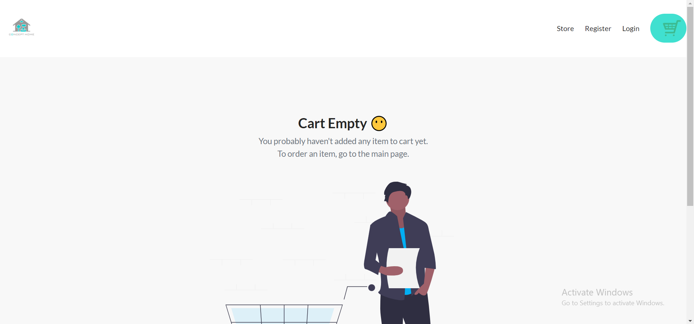
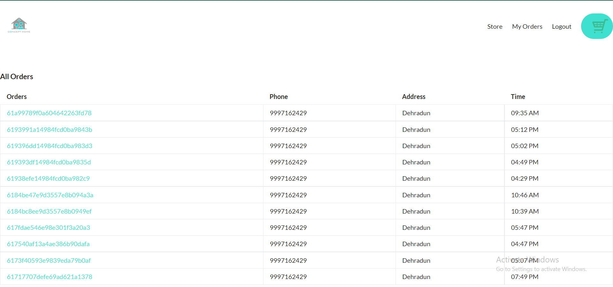
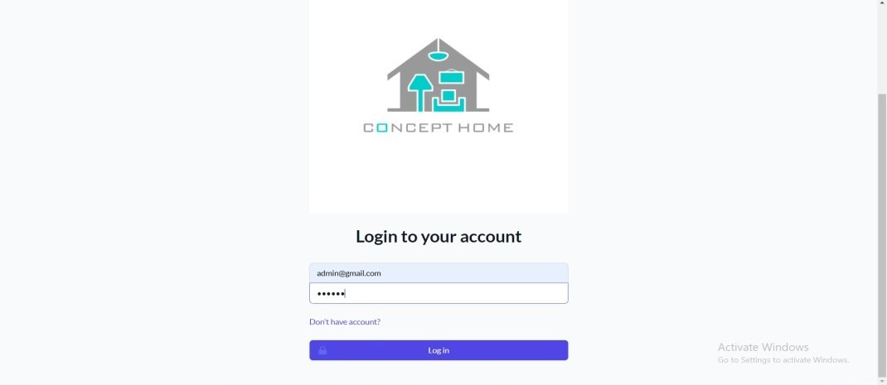
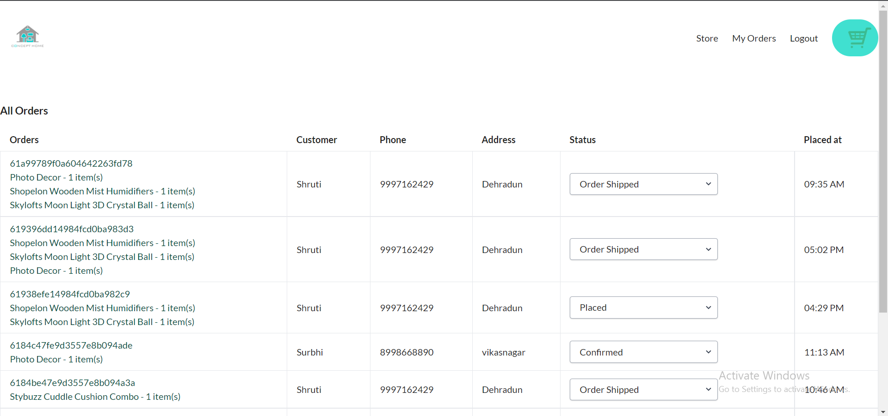

> Online Store Web App for Room Decor items

# Overview
- This project is built by using Nodejs, Express JS and MongoDb, in which various concepts are implemented and innovative features are added to upgrade the app’s functionality.
- I have designed an e-commerce site of online store for Room Décor Items Shop. In this build, customers can create an account and shop for different, fascinating décor items for interiors of their respective houses. They can add selected items to their cart and place an order. Moreover, admin role has also been added and his functions.
Furthermore, in order to execute certain insightful ideas and integrate Nodejs modules, framework and other powerful packages. This helped in levelling up the project in numerous ways.
- **Bonus Feature:** As mentioned above, users can add items to their respective carts and place an order online, however, after placing an order, they can also track their orders’ status. Therefore, in order to do so, real-time tracker feature has been implemented in this build. Basically, as soon as the admin will approve of status updates, the customer will be able to see those updates on app.
- **Notification Library- Awesome -Notifications npm library:** Notification library has been used in the project to make app more user friendly. As soon as the customer will add items to the cart and status will get updated, success message popup would appear on screen to acknowledge.
Similarly, for admin, success message popup will appear as soon as the new order gets added. In case of any warning, alert message popup would appear on screen.

# Technologies used
- ### Node.js 
- ### Express.js
- ### MongoDB
- ### Tailwind CSS
- ### Passport.js
- ### Socket.IO
- ### Laravel-Mix

# Snapshots

## Home Page

## Customer Role

### Register Page

### Register Page (Validation)

### Login Page (Validation)

### Adding items to cart

### Orders Page

### Orders Tracking Page

## Admin Role

### Login Page

### Orders Page

### Real-time tracking order response

